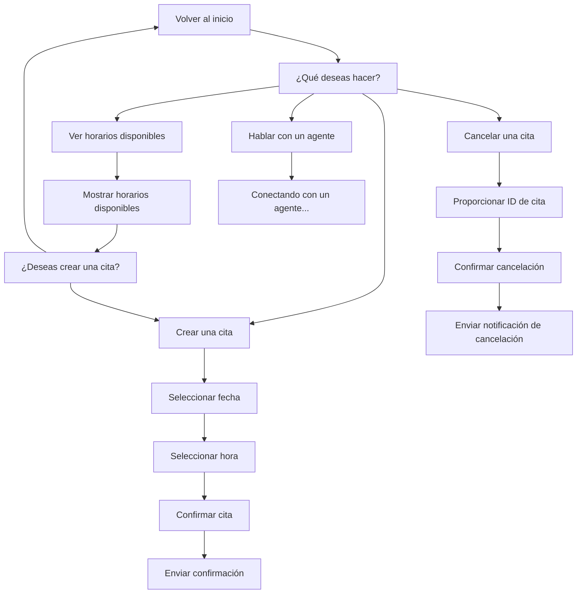

# Twilio WhatsApp Assistant con NestJS

Este proyecto implementa un asistente virtual para WhatsApp utilizando **Twilio** y **NestJS**. El asistente permite a los usuarios realizar las siguientes acciones:

- Crear citas.
- Cancelar citas.
- Ver horarios disponibles.
- Hablar con un agente humano.

El flujo del asistente está diseñado para guiar al usuario paso a paso y puede integrarse con servicios externos como Redis para la persistencia del estado y OpenAI para respuestas inteligentes.

---

## **Características principales**

- **Flujo de conversación estructurado**: Basado en un árbol de decisiones.
- **Persistencia del estado**: Utiliza Redis para recordar el contexto de la conversación.
- **Integración con Twilio**: Para enviar y recibir mensajes de WhatsApp.
- **Soporte para agentes humanos**: Permite notificar a un agente humano cuando el usuario lo solicita.
- **Extensibilidad**: Puede integrarse con OpenAI para respuestas inteligentes.

---

## **Diagrama del flujo del asistente**



---

## **Requisitos previos**

- Node.js (v16 o superior).
- Redis instalado y en ejecución.
- Cuenta de Twilio con un número habilitado para WhatsApp.
- ngrok para exponer tu servidor local a una URL pública.

---

## **Instalación**

Clona este repositorio:

```bash
git clone https://github.com/tu-usuario/twilio-whatsapp-assistant.git
cd twilio-whatsapp-assistant
```

Instala las dependencias:

```bash
npm install
```

Configura las variables de entorno: Crea un archivo `.env` en la raíz del proyecto con el siguiente contenido:

```env
TWILIO_ACCOUNT_SID=tu_account_sid
TWILIO_AUTH_TOKEN=tu_auth_token
TWILIO_PHONE_NUMBER=whatsapp:+14155238886
TEST_PHONE_NUMBER=whatsapp:+5219999999999
NGROK_URL=https://<tu-ngrok-url>
REDIS_HOST=localhost
REDIS_PORT=6379
OPENAI_API_KEY=tu_openai_api_key
```

Inicia Redis: Si Redis no está instalado, instálalo y ejecútalo:

```bash
sudo apt update
sudo apt install redis
redis-server
```

---

## **Puesta en marcha**

Inicia el servidor NestJS:

```bash
npm run start:dev
```

Exponer el servidor con ngrok: Instala ngrok si no lo tienes:

```bash
sudo apt install ngrok
```

Luego, ejecuta:

```bash
ngrok http 3000
```

Copia la URL pública generada (por ejemplo, `https://a9bc-189-235-123-216.ngrok-free.app`) y actualiza la variable `NGROK_URL` en el archivo `.env`.

Configura el webhook en Twilio: Ve a la Consola de Twilio y configura el webhook de mensajes entrantes con la URL pública de ngrok, apuntando al endpoint `/whatsapp-reply`. Ejemplo:

```
https://a9bc-189-235-123-216.ngrok-free.app/whatsapp-reply
```

---

## **Uso**

### Pruebas en WhatsApp

1. Envía un mensaje de WhatsApp al número de Twilio configurado.
2. Sigue las instrucciones del asistente para:
   - Crear una cita.
   - Cancelar una cita.
   - Ver horarios disponibles.
   - Hablar con un agente.

### Flujo de conversación

- Escribe "Hola" para iniciar el asistente.
- Selecciona una opción del menú principal:
  1. Crear una cita.
  2. Cancelar una cita.
  3. Ver horarios disponibles.
  4. Hablar con un agente.

---

## **Estructura del proyecto**

- `src/app.controller.ts`: Controlador principal que maneja las rutas.
- `src/app.service.ts`: Lógica del asistente, incluyendo el flujo de conversación y la integración con Twilio.
- `sms-log`: Módulo para registrar logs de mensajes SMS.
- `Redis`: Utilizado para almacenar el estado de la conversación de cada usuario.

---

## **Extensiones futuras**

- **Integración con OpenAI**:  
  Respuestas inteligentes basadas en IA para preguntas complejas.
- **Soporte para múltiples idiomas**:  
  Implementar detección de idioma y respuestas multilingües.
- **Integración con sistemas de soporte**:  
  Transferir conversaciones a Zendesk, Freshdesk o Intercom.

---

## **Problemas comunes**

### Error: Límite diario de mensajes alcanzado

Si estás usando una cuenta de prueba de Twilio, tienes un límite de 9 mensajes diarios. Solución:

- Actualiza a una cuenta de pago en Twilio.
- Optimiza el uso de mensajes durante las pruebas.

### Error: Redis no está en ejecución

Asegúrate de que Redis esté corriendo:

```bash
redis-server
```

---

## **Contribuciones**

Si deseas contribuir a este proyecto, por favor abre un issue o envía un pull request.

---

## **Licencia**

Este proyecto está bajo la licencia MIT.
